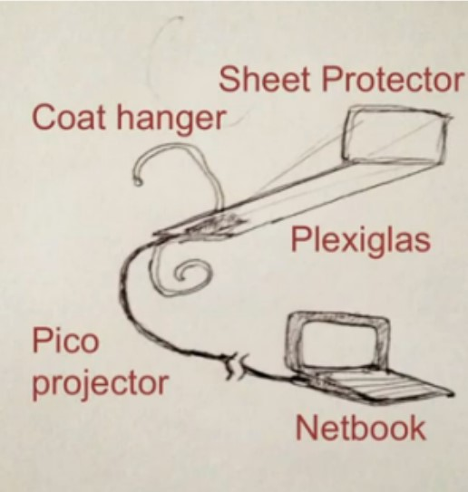
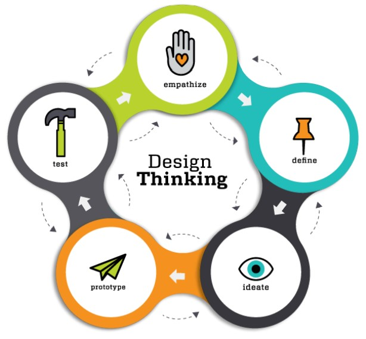
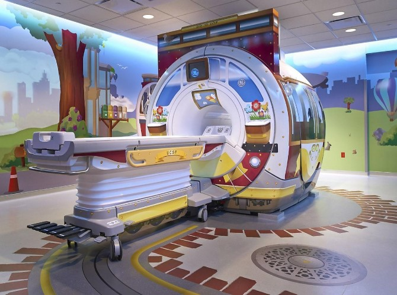

# Entrega - Desafio de inovação
- Lucas de Castro Zanoni

## Design Thinking
O objetivo do Design Thinking é aprimorar a usabilidade de um produto, com base nas principais dores do usuário, visando criar soluções mais personalizadas. Essa abordagem é uma ferramenta estratégica centrada nas pessoas, como descrito por Tim Brown.

> “Design thinking é uma abordagem de inovação centrada no ser humano que utiliza o kit de ferramentas de Design para integrar as necessidades das pessoas, as possibilidades tecnológicas e os requisitos para o sucesso dos negócios.” - Tim Brown

- A ideia é que esse processo ocorra de forma coletiva e colaborativa, reunindo diversas pessoas e o máximo de perspectivas diferentes com o processo feito por meio de etapas.
- Três fases criativas, **descoberta**, **ideação** e **experimentação**, que podem ocorrer em cinco etapas, **empatia**, **definição**, **ideação**, **prototipação** e **validação**.

## Imersão
Busca-se:
1. Mapear os fatores, elementos e recursos disponíveis.
2. Estipular os resultados desejados.
3. Levantar as informações pertinentes.
4. Identificar o que já foi feito.
5. Entender as perspectivas.

> [!NOTE]
> A imersão é subdividida em duas etapas: a imersão preliminar e a imersão profunda.

A **imersão preliminar** ocorre quando a equipe não está muito familiarizada com o tema e precisa de uma introdução. Nessa etapa, são determinadas as fronteiras do projeto.

A **imersão profunda** ocorre pela busca do caminho que irá nortear a fase seguinte: a ideação. Contém também um plano de pesquisa, como entrevistas ou caderno de sensibilização.

## Análise ou Interpretação
Toda a informação coletada na etapa anterior agora deve ser reunida em relatórios para que sua equipe possa analisar, observar e sintetizar os principais problemas identificados.

## Ideação
A ideação é a terceira etapa do design thinking, e é nela que ocorre o "brainstorming", onde é possível coletar todo o tipo de ideia e opiniões afim de chegar a uma solução influenciada por vários panoramas, sem julgamentos de ideias "boas ou ruins".

## Prototipação
A prototipação é a primeira representação de uma ideia, possibilitando a identificação de erros antes do lançamento do produto final. O protótipo deve mostrar os conceitos básicos de forma simples e rápida, permitindo economizar tempo.

    

## Implementação
Nessa etapa, colocam-se as soluções à prova com testes e experimentos. Esta fase ainda é interativa, então é necessário ouvir o feedback dos usuários novamente.

>[!NOTE]
>Apesar de esta ser considerada a "etapa final do design thinking", a premissa da metodologia é justamente a de não ser linear.

    

## Habilidades de design thinking
- **Interesse do Público**: um novo produto ou serviço surge a partir de uma demanda que cubra as necessidades de uma parcela de pessoas. Assim, cabe à equipe de design thinking ter empatia para entender essas personas e suas dores e fazer a criação de forma que vá ao encontro do que desejam, surpreendendo-as positivamente;
- **Viabilidade do Negócio**: por mais brilhante que seja uma ideia, ela precisa ser mercadológica — ser produzida em tempo hábil, sem ultrapassar o orçamento e gerar uma margem ampla de lucro;
- **Possibilidade Técnica**: para que a ideia se torne real, é fundamental que o planejamento inicial seja acertado, com objetivos técnicos bem desenhados e com consenso estabelecido pela empresa. A fase de testes e prototipação vai permitir que o produto chegue ao mercado com suas características alinhadas.

## Ferramentas úteis durante o processo de Design Thinking

### Brainstorming
- Ferramenta perfeita para gerar ideias e soluções. Consiste em um exercício coletivo que ajuda a descobrir soluções criativas.

### Gamificação
- Ao usar pontos e outros incentivos como recompensas, os designers e demais profissionais podem aplicar mecânicas de jogos em seu trabalho.

### Mapa de Empatia
- É um diagrama usado para definir e entender melhor os clientes, focando em sua linguagem e comportamento em relação ao produto ou serviço.

### MVP
- Um MVP é uma versão inicial de um produto que tem características suficientes para permitir que os usuários testem seu conceito central rapidamente.

### Cocriação
- Na cocriação você integra o cliente no processo de desenvolvimento da solução, obtendo insights e perspectivas diretas que podem enriquecer e agilizar todo o processo.

### Desk Research
- O desk research é uma técnica de coleta de dados pela qual profissionais buscam informações de recursos existentes — como livros, artigos acadêmicos, de revistas ou online.

## Exemplo de aplicação do Design Thinking:

Nos anos 2000, o chefe de design da GE Healthcare lidava com o problema de desenvolver uma nova máquina de ressonância magnética altamente tecnológica e eficiente. Apesar do projeto estar avançado e concorrer a prêmios de design, uma visita a um hospital revelou um problema crucial: crianças ficavam aterrorizadas com a máquina, tornando os exames um processo angustiante.

Percebendo a importância da experiência do usuário, a equipe da GE adotou o Design Thinking para repensar o problema. Em vez de focar apenas na tecnologia, eles se colocaram no lugar das crianças e desenvolveram uma solução criativa e simples: transformar as salas de ressonância magnética em ambientes lúdicos, como navios piratas ou naves espaciais, usando adesivos.

    

Essa abordagem não só resolveu o problema do medo das crianças, mas também tornou os exames uma experiência mais agradável e acolhedora. O caso da GE ilustra a importância da imersão e empatia no Design Thinking, destacando como entender as necessidades dos usuários pode levar a soluções inovadoras e eficazes, muitas vezes mais simples do que se imagina.

## Considerações Finais
- O Design Thinking é um método muito eficiente na resolução de problemas complexos e também naqueles que requerem soluções inovadoras. 
- É um método não linear que permite que as soluções sejam reavaliadas e melhoradas. 
- E um processo que tem grande necessidade de equipes com diversos profissionais de áreas distintas para que as opiniões e ideias coletadas sejam o mais abrangentes possíveis.

## REFERÊNCIAS:

- [Ideação: o que é, conceito e como realizar na prática](https://liga.ventures/insights/artigos/ideacao-o-que-e-conceito-e-como-realizar-na-pratica/)
- [Imersão Design Thinking: como funciona essa fase?](https://www.mjvinnovation.com/pt-br/blog/como-funciona-a-imersao-no-design-thinking/)
- [Design Thinking: o que é, como funciona e quais são as vantagens](https://www.docusign.com/pt-br/blog/design-thinking-o-que-e-como-funciona-e-quais-sao-vantagens)
- [5-motivos-para-voce-prototipar-qualquer-coisa-2](https://escoladesignthinking.echos.cc/blog/2016/03/5-motivos-para-voce-prototipar-qualquer-coisa-2/)
- [Aplicação do Design Thinking: como essa metodologia ajudou a GE?](https://www.ieepeducacao.com.br/design-thinking-ge/)

